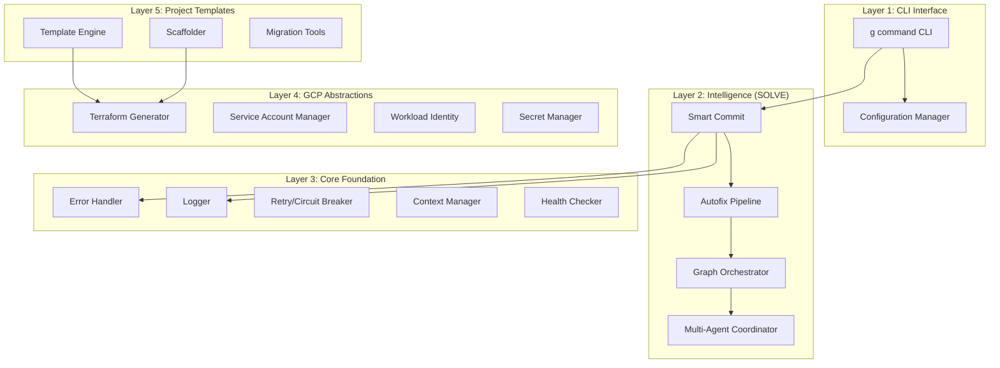

# Genesis Architecture & Build Plan

## Current Reality Check

We have:
- Vision documents (GRAND_DESIGN.md, FEATURE_MATRIX.md)
- Old bootstrapper code that needs refactoring
- SOLVE framework to integrate
- 6 target projects to migrate

We DON'T have:
- The actual Genesis platform built yet
- Core foundation implementation
- SOLVE integrated
- Working CLI (`g` command)

## Technical Architecture

### System Layers



## Implementation Build Plan

### Phase 1: Core Foundation (What We Build First)

#### 1.1 Basic Project Structure
```
genesis/
├── core/                    # Core foundation library
│   ├── errors/             # Error handling
│   ├── logging/            # Structured logging
│   ├── retry/              # Retry logic
│   ├── health/             # Health checks
│   └── context/            # Context propagation
├── cli/                    # CLI implementation
│   ├── bin/                # g command entry point
│   └── commands/           # CLI commands
├── intelligence/           # SOLVE integration
│   └── (copy from SOLVE)
└── templates/              # Project templates
    ├── cloud-run/
    ├── cloud-function/
    └── static-site/
```

#### 1.2 Core Components to Build

**A. Error & Logging Foundation** (`core/`)
```python
# core/errors/handler.py
class GenesisError:
    - Structured error codes
    - Stack trace capture
    - Error categorization
    - Correlation ID attachment

# core/logging/logger.py
class GenesisLogger:
    - Structured JSON output
    - Log levels
    - Context injection
    - Cloud Logging integration
```

**B. Resilience Patterns** (`core/retry/`)
```python
# core/retry/circuit_breaker.py
class CircuitBreaker:
    - State management (open/closed/half-open)
    - Failure threshold tracking
    - Automatic recovery

# core/retry/retry.py
class RetryHandler:
    - Exponential backoff
    - Jitter
    - Max attempts
    - Retry conditions
```

**C. CLI Implementation** (`cli/`)
```python
# cli/bin/g
#!/usr/bin/env python
- Entry point for Genesis CLI
- Command routing
- Global flags handling

# cli/commands/
- init.py      # Initialize Genesis
- new.py       # Create new project
- deploy.py    # Deploy to GCP
- commit.py    # Smart commit
- dev.py       # Local development
```

#### 1.3 SOLVE Integration
```
intelligence/
├── smart_commit/     # Copy from SOLVE
├── autofix/          # Copy from SOLVE
├── graph/            # Graph orchestration
└── agents/           # Multi-agent system
```

### Phase 2: GCP Platform Layer

#### 2.1 Terraform Modules
```
modules/
├── compute/
│   ├── cloud-run/
│   ├── cloud-functions/
│   └── gke/
├── data/
│   ├── firestore/
│   ├── bigquery/
│   └── storage/
├── networking/
│   ├── vpc/
│   ├── load-balancer/
│   └── cdn/
└── security/
    ├── iam/
    ├── secret-manager/
    └── workload-identity/
```

#### 2.2 Project Templates
```
templates/
├── base/                 # Shared across all templates
│   ├── .genesis/
│   ├── Dockerfile
│   └── cloudbuild.yaml
├── cloud-run/
│   ├── src/
│   ├── terraform/
│   └── genesis.yaml
├── cloud-function/
│   ├── src/
│   ├── terraform/
│   └── genesis.yaml
└── static-site/
    ├── src/
    ├── terraform/
    └── genesis.yaml
```

### Phase 3: Agent-Cage Migration (Proof of Concept)

#### 3.1 Migration Strategy
1. Analyze agent-cage codebase
2. Extract patterns into Genesis modules
3. Generate Genesis-based replacement
4. Validate functionality
5. Measure code reduction

#### 3.2 Success Metrics
- [ ] 80% code reduction achieved
- [ ] All tests passing
- [ ] Performance maintained or improved
- [ ] Deployment time < 5 minutes

## Build Order (Priority)

### Week 1-2: Foundation
1. **Day 1-2**: Set up project structure, copy SOLVE
2. **Day 3-4**: Build error handling and logging
3. **Day 5-6**: Implement retry/circuit breaker
4. **Day 7-8**: Create basic CLI with init/new commands
5. **Day 9-10**: Integrate smart-commit from SOLVE

### Week 3-4: GCP Integration
1. **Day 11-12**: Create Terraform module structure
2. **Day 13-14**: Build Cloud Run module
3. **Day 15-16**: Implement service account management
4. **Day 17-18**: Add deployment pipeline
5. **Day 19-20**: Test with simple project

### Week 5-6: Agent-Cage Migration
1. **Day 21-22**: Analyze agent-cage requirements
2. **Day 23-24**: Build missing modules
3. **Day 25-26**: Perform migration
4. **Day 27-28**: Validate and measure
5. **Day 29-30**: Document lessons learned

## Key Decisions Needed

1. **Programming Language for CLI**
   - Python (matches SOLVE, easier integration)
   - Go (better performance, single binary)
   - Decision: **Python** for consistency with SOLVE

2. **Configuration Format**
   - YAML (human-friendly)
   - TOML (better for complex configs)
   - Decision: **YAML** for consistency

3. **Template Engine**
   - Jinja2 (Python standard)
   - Custom (more control)
   - Decision: **Jinja2** for faster development

4. **Graph Database**
   - Neo4j (as planned)
   - In-memory for MVP
   - Decision: **In-memory first**, Neo4j later

## Success Criteria

### Phase 1 Complete When:
- [ ] Core error handling works
- [ ] Logging integrates with Cloud Logging
- [ ] Basic CLI can create projects
- [ ] Smart-commit runs successfully
- [ ] Local development works

### Phase 2 Complete When:
- [ ] Projects deploy to GCP
- [ ] Terraform modules generate correctly
- [ ] Service accounts work with WIF
- [ ] Monitoring dashboards created
- [ ] Rollback works

### Phase 3 Complete When:
- [ ] Agent-cage migrated
- [ ] 80% code reduction achieved
- [ ] All functionality preserved
- [ ] Performance acceptable
- [ ] Documentation complete

## Next Immediate Actions

1. **Copy SOLVE** into `intelligence/` directory
2. **Create** `core/errors/handler.py` with basic error handling
3. **Create** `core/logging/logger.py` with structured logging
4. **Create** `cli/bin/g` entry point script
5. **Test** basic functionality with simple example

This is what we should build FIRST, before writing user documentation!
