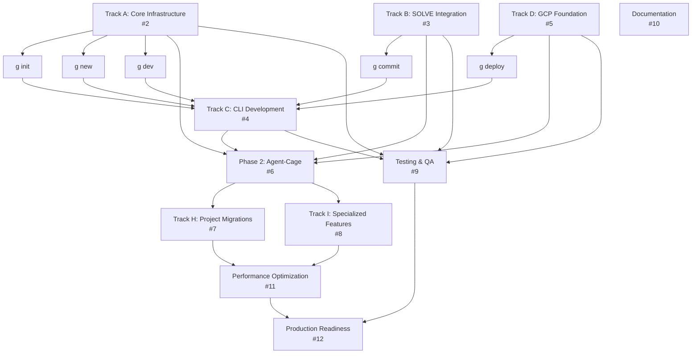

# Genesis Implementation Dependency Chain

## Critical Path Analysis



## Detailed Dependency Matrix

| Issue | Title | Direct Dependencies | Blocking For | Can Start |
|-------|-------|-------------------|---------------|-----------|
| **#2** | Track A: Core Infrastructure | None | #4 (partial), #6, #9 | **Immediately** |
| **#3** | Track B: SOLVE Integration | None | #4 (g commit), #6, #9 | **Immediately** |
| **#5** | Track D: GCP Foundation | None | #4 (g deploy), #6, #9 | **Immediately** |
| **#4** | Track C: CLI Development | #2 (error/logging), #3 (smart-commit), #5 (deploy) | #6 | After partial A, B, D |
| **#6** | Phase 2: Agent-Cage Migration | #2, #3, #4, #5 (all Phase 1) | #7, #8, #11 | After Phase 1 |
| **#7** | Track H: Project Migrations | #6 (proven platform) | #11 | After Phase 2 |
| **#8** | Track I: Specialized Features | #6 (core platform ready) | #11 | After Phase 2 |
| **#9** | Testing & QA | #2, #3, #4, #5 (components to test) | #12 | Continuous |
| **#10** | Documentation | None | #12 | **Immediately** |
| **#11** | Performance Optimization | #7, #8 (full implementation) | #12 | After Phase 3 |
| **#12** | Production Readiness | #9, #10, #11 (all quality gates) | Release | Final Phase |

## Parallel Work Streams

### Stream 1: Core Platform (No Dependencies)
```
Start Day 1:
├── #2: Core Infrastructure (Team 1: 2 engineers)
├── #3: SOLVE Integration (Team 2: 1 engineer)
├── #5: GCP Foundation (Team 3: 2 engineers)
└── #10: Documentation (1 technical writer)
```

### Stream 2: CLI Development (Partial Dependencies)
```
Start Day 3-5 (after core components ready):
└── #4: CLI Development (1 engineer)
    ├── Needs #2 for: error handling, logging
    ├── Needs #3 for: g commit command
    └── Needs #5 for: g deploy command
```

### Stream 3: Testing (Continuous)
```
Start Day 3 (as components become available):
└── #9: Testing & QA (1 QA engineer)
    ├── Test #2 components as completed
    ├── Test #3 integration points
    ├── Test #4 CLI commands
    └── Test #5 infrastructure
```

## Detailed Task Dependencies

### Issue #2: Core Infrastructure
**Can Start**: Immediately
**Subtasks & Dependencies**:
- `core/errors/handler.py` - No deps ✅ DONE
- `core/logging/logger.py` - No deps ✅ DONE
- `core/retry/retry.py` - No deps
- `core/retry/circuit_breaker.py` - Needs retry.py
- `core/health/checker.py` - Needs logger.py
- `core/context/manager.py` - Needs logger.py
- `core/lifecycle/shutdown.py` - Needs health/checker.py

### Issue #3: SOLVE Integration
**Can Start**: Immediately
**Subtasks & Dependencies**:
- Copy SOLVE code - No deps ✅ DONE
- Smart-commit integration - Needs #2 logger
- Autofix pipeline - Needs smart-commit
- Graph orchestration - No deps (in-memory first)
- Multi-agent coordination - Needs graph orchestration

### Issue #4: CLI Development
**Can Start**: Partially after #2, #3, #5 basics
**Command Dependencies**:
```
g init     → Needs: #5 (GCP project setup)
g new      → Needs: #2 (error handling), templates
g dev      → Needs: #2 (logging), hot reload
g deploy   → Needs: #5 (Terraform), #2 (error handling)
g commit   → Needs: #3 (smart-commit)
g test     → Needs: #2 (logging)
g rollback → Needs: #5 (Terraform state)
```

### Issue #5: GCP Foundation
**Can Start**: Immediately
**Subtasks & Dependencies**:
- Terraform modules structure - No deps
- Service accounts - No deps
- Workload Identity - Needs service accounts
- State backend - No deps
- Cloud Build - Needs Terraform modules
- Secret Manager - Needs service accounts

### Issue #6: Phase 2 Agent-Cage
**Cannot Start Until**:
- #2 COMPLETE (all error handling, logging, retry logic)
- #3 COMPLETE (SOLVE fully integrated)
- #4 COMPLETE (CLI working)
- #5 COMPLETE (can deploy to GCP)

**Why**: Need full foundation to prove 80% code reduction

### Issue #7: Project Migrations
**Cannot Start Until**:
- #6 COMPLETE (proven with agent-cage)

**Migration Order** (based on complexity):
1. `claude-talk` - Simplest (serverless only)
2. `housteau-website` - Simple (static + CDN)
3. `wisdom_of_crowds` - Medium (like agent-cage minus containers)
4. `job-hopper` - Complex (full-stack + GDPR)
5. `SOLVE` - Integration (becomes part of Genesis)

### Issue #8: Specialized Features
**Cannot Start Until**:
- #6 COMPLETE (platform proven)

**Can Parallelize**:
- CDN setup - Independent
- GDPR modules - Independent
- SOC2 features - Independent
- Cost optimization - Needs metrics from #6

## Critical Path

The longest dependency chain (critical path):
```
#2 (Core) → #4 (CLI) → #6 (Agent-Cage) → #7 (Migrations) → #11 (Optimization) → #12 (Production)
```

## Risk Mitigation for Dependencies

### Risk: CLI (#4) blocked by multiple tracks
**Mitigation**:
- Start CLI structure immediately
- Implement commands incrementally as dependencies complete
- Use mocks for incomplete dependencies

### Risk: Phase 2 (#6) blocked until all Phase 1 complete
**Mitigation**:
- Start analysis and planning while waiting
- Prepare test cases in advance
- Begin documentation

### Risk: Sequential migration in Phase 3
**Mitigation**:
- Multiple engineers can work on different projects
- Share learnings between migrations
- Create migration toolkit from first project

## Gantt Chart View

```
Day:    1  2  3  4  5  6  7  8  9  10 11 12 13 14 15 16 17 18 19 20
#2:     [===========]
#3:     [===========]
#5:     [===============]
#10:    [=============================================>
#4:        [===========]
#9:        [==========================================>
#6:                       [==================]
#7:                                            [==========]
#8:                                            [==========]
#11:                                                      [====]
#12:                                                           [===]
```

## Dependency Validation Checklist

Before starting any issue, verify:

- [ ] All prerequisite issues are COMPLETE
- [ ] Required components are tested
- [ ] Integration points are documented
- [ ] Blocking issues are identified
- [ ] Parallel work opportunities identified
