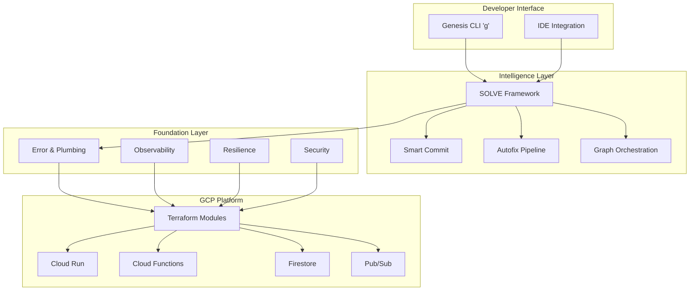

# Genesis Platform

## What is Genesis?

Genesis is a universal infrastructure platform that eliminates 80% of boilerplate code across projects by providing production-ready foundations, intelligent automation, and unified tooling. It transforms the way teams build and deploy cloud-native applications on Google Cloud Platform.

## The Problem Genesis Solves

Modern projects suffer from:
- **70-80% code duplication** across projects (error handling, logging, monitoring, CI/CD)
- **Inconsistent implementations** of common patterns
- **Slow project bootstrapping** (weeks to set up production infrastructure)
- **Fragmented tooling** across different technology stacks
- **Manual, error-prone deployments** without proper quality gates

## The Genesis Solution

Genesis provides:

### 🧠 **Intelligence Layer** (from SOLVE)
- Smart-commit workflow with quality gates
- Three-stage autofix pipeline (format → validate → AI fix)
- Graph-driven orchestration using Neo4j
- Multi-agent coordination for parallel development

### 🏗️ **Production Foundation**
- Structured error handling with stack traces
- Retry logic with circuit breakers
- Health checks and graceful shutdown
- Request tracking and correlation IDs
- Structured logging and metrics collection

### ☁️ **GCP Platform**
- Complete Terraform modules for all GCP services
- Service account impersonation (no local keys)
- Per-repo isolation with CLOUDSDK_CONFIG
- Workload Identity Federation
- State management and rollback capabilities

### 🚀 **Unified Developer Experience**
- Single CLI command: `g`
- Project scaffolding in minutes
- Local development with hot reload
- Integrated debugging and testing
- Environment management

## Key Benefits

### For Developers
- **80% less code to write** - Focus on business logic, not plumbing
- **Instant project setup** - From zero to deployed in minutes
- **Consistent patterns** - Same structure across all projects
- **Built-in best practices** - Security, monitoring, testing included

### For Operations
- **Production-ready from day one** - All operational concerns addressed
- **Unified monitoring** - Single pane of glass across projects
- **Automated compliance** - Security and governance built-in
- **Cost optimization** - Resource management and quotas

### For Business
- **10x faster delivery** - Ship features, not infrastructure
- **90% fewer production issues** - Quality gates prevent bugs
- **50% lower cloud costs** - Optimized resource usage
- **Reduced technical debt** - Consistent, maintainable codebases

## Architecture Overview



## Projects Using Genesis

| Project | Type | Code Reduction |
|---------|------|----------------|
| agent-cage | Container orchestration | 80% |
| claude-talk | MCP server | 75% |
| wisdom_of_crowds | Multi-agent framework | 79% |
| job-hopper | Full-stack application | 75% |
| housteau-website | Static site | 70% |
| SOLVE | AI orchestration | 80% |

## Getting Started

```bash
# Install Genesis CLI
curl -sSL https://genesis.dev/install | bash

# Create new project
g new my-project

# Deploy to GCP
g deploy

# Run locally
g dev
```

## Implementation Phases

### Phase 1: Foundation
Build core plumbing, error handling, logging, and basic GCP infrastructure that all projects need.

### Phase 2: Agent-Cage Migration
Prove Genesis with the most complex project, adding container orchestration and advanced features.

### Phase 3: Universal Adoption
Migrate all remaining projects, achieving 78% total code reduction across the portfolio.

## Documentation

- [GRAND_DESIGN.md](./GRAND_DESIGN.md) - Complete architectural vision
- [FEATURE_MATRIX.md](./FEATURE_MATRIX.md) - Detailed capability matrix
- [Getting Started Guide](../01-getting-started/quickstart.md) - 5-minute setup
- [Architecture Deep Dive](../02-architecture/foundation.md) - Technical details
- [API Reference](../03-api-reference/cli.md) - Complete command reference

## Support

- GitHub Issues: [genesis/issues](https://github.com/genesis/issues)
- Documentation: [docs.genesis.dev](https://docs.genesis.dev)
- Community: [discord.genesis.dev](https://discord.genesis.dev)

---

Genesis: **Write features, not plumbing.**