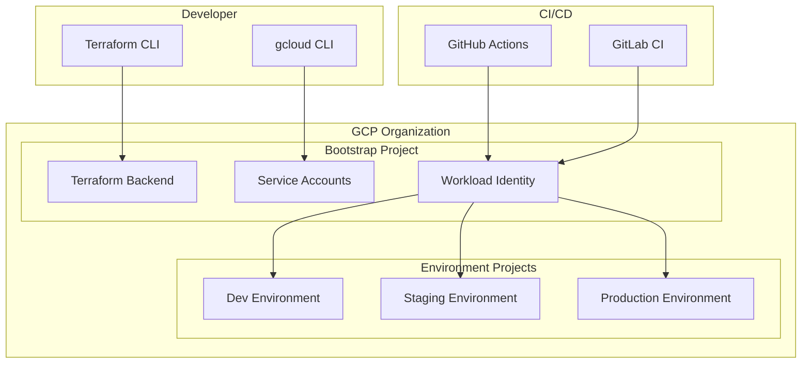
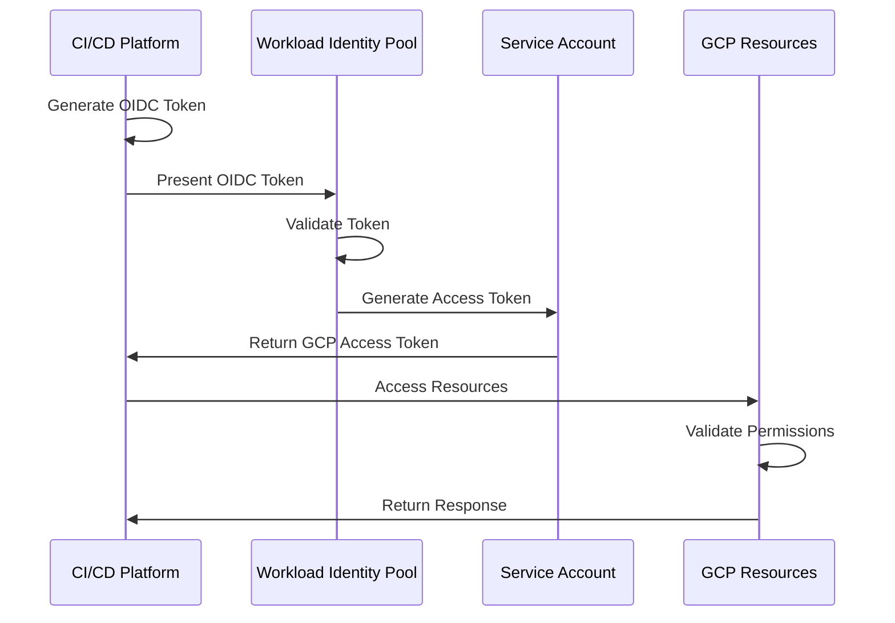
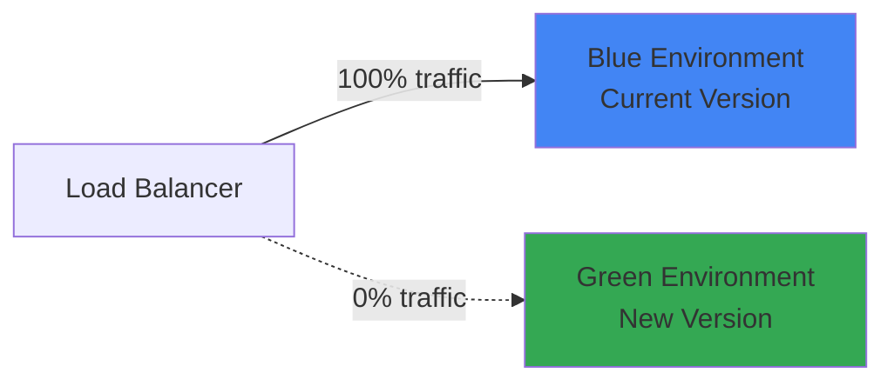

# GCP Bootstrap Deployer - Architecture

## Overview

The GCP Bootstrap Deployer implements a modular, scalable architecture for provisioning and managing Google Cloud Platform infrastructure using Terraform. The architecture follows cloud-native principles with a focus on security, automation, and multi-environment support.

## Architecture Principles

### 1. Infrastructure as Code (IaC)
- All infrastructure defined in Terraform
- Version controlled configurations
- Reproducible deployments
- Drift detection and remediation

### 2. GitOps Workflow
- Git as single source of truth
- Pull request-based changes
- Automated validation and testing
- Continuous deployment pipelines

### 3. Zero Trust Security
- Workload Identity Federation for authentication
- No long-lived credentials
- Least privilege access model
- Defense in depth approach

### 4. Multi-Environment Strategy
- Isolated environments (dev, staging, prod)
- Environment-specific configurations
- Progressive deployment model
- Rollback capabilities

## System Components

### Core Infrastructure Layer



### Terraform State Management

The architecture uses a centralized state management approach:

1. **Remote Backend**: GCS bucket for state storage
2. **State Locking**: Prevents concurrent modifications
3. **Versioning**: Historical state preservation
4. **Encryption**: At-rest encryption for security
5. **Workspaces**: Environment isolation

```hcl
terraform {
  backend "gcs" {
    bucket = "terraform-state-${project_id}"
    prefix = "bootstrap"
  }
}
```

### Authentication Architecture

#### Workload Identity Federation Flow



Benefits:
- No service account keys to manage
- Short-lived tokens (1 hour default)
- Attribute-based access control
- Auditable access patterns

### Network Architecture

#### VPC Design

```yaml
Network Topology:
  - Hub-Spoke Model
  - Regional VPCs per environment
  - Subnet per availability zone
  - Private Google Access enabled
  - Cloud NAT for egress
```

#### Network Segmentation

| Environment | CIDR Block | Purpose |
|------------|------------|---------|
| Development | 10.0.0.0/16 | Dev workloads |
| Staging | 10.1.0.0/16 | Pre-prod testing |
| Production | 10.2.0.0/16 | Production services |
| Management | 10.255.0.0/16 | Shared services |

### Security Architecture

#### Defense in Depth Layers

1. **Identity & Access Management**
   - Workload Identity Federation
   - Service account impersonation
   - Conditional access policies
   - MFA enforcement

2. **Network Security**
   - VPC firewall rules
   - Cloud Armor WAF
   - Private Google Access
   - VPC Service Controls

3. **Data Protection**
   - Encryption at rest (Cloud KMS)
   - Encryption in transit (TLS 1.3)
   - Secret Manager for credentials
   - Data Loss Prevention (DLP)

4. **Monitoring & Compliance**
   - Cloud Security Command Center
   - Cloud Asset Inventory
   - Access Transparency logs
   - Compliance validation

### CI/CD Architecture

#### GitHub Actions Pipeline

```yaml
Workflow Stages:
  1. Code Checkout
  2. Security Scanning
     - Secret detection
     - SAST analysis
     - Dependency scanning
  3. Terraform Validation
     - Format check
     - Syntax validation
     - Policy compliance
  4. Plan Generation
     - Cost estimation
     - Change preview
     - Risk assessment
  5. Manual Approval (prod)
  6. Apply Changes
  7. Post-deployment Tests
  8. Notification
```

#### GitLab CI Pipeline

Similar structure with GitLab-specific features:
- Dynamic environments
- Review apps
- Merge request integration
- Container scanning

### Module Architecture

```
modules/
├── bootstrap/
│   ├── main.tf           # Core bootstrap resources
│   ├── iam.tf            # IAM configuration
│   ├── network.tf        # Network setup
│   ├── storage.tf        # Storage resources
│   ├── variables.tf      # Input variables
│   └── outputs.tf        # Output values
├── compute/
│   ├── gke/             # GKE cluster module
│   ├── gce/             # Compute instances
│   └── cloud-run/       # Serverless compute
├── data/
│   ├── gcs/             # Cloud Storage
│   ├── bigquery/        # Data warehouse
│   └── firestore/       # NoSQL database
└── security/
    ├── kms/             # Key management
    ├── secret-manager/  # Secrets storage
    └── vpc-sc/          # VPC Service Controls
```

### Deployment Patterns

#### Blue-Green Deployment



#### Canary Deployment

Progressive rollout strategy:
1. Deploy to canary (5% traffic)
2. Monitor metrics and errors
3. Gradually increase traffic
4. Full rollout or rollback

### Disaster Recovery

#### Backup Strategy

- **State Files**: Versioned in GCS with 90-day retention
- **Configuration**: Git repository with tagged releases
- **Data**: Automated snapshots and exports
- **Secrets**: Secret Manager with versioning

#### Recovery Procedures

| Scenario | RTO | RPO | Recovery Method |
|----------|-----|-----|-----------------|
| State corruption | 15 min | 0 | Restore from GCS version |
| Environment failure | 30 min | 1 hour | Redeploy from Git |
| Regional outage | 2 hours | 4 hours | Failover to DR region |
| Complete loss | 4 hours | 24 hours | Full restore from backups |

### Monitoring Architecture

#### Observability Stack

```yaml
Metrics:
  - Cloud Monitoring metrics
  - Custom application metrics
  - SLI/SLO tracking
  - Cost metrics

Logging:
  - Centralized log aggregation
  - Structured logging
  - Log-based metrics
  - Audit logging

Tracing:
  - Distributed tracing
  - Request flow visualization
  - Performance profiling
  - Dependency mapping

Alerting:
  - Threshold-based alerts
  - Anomaly detection
  - Escalation policies
  - Integration with PagerDuty/Slack
```

### Cost Management

#### Resource Optimization

1. **Compute Optimization**
   - Right-sizing recommendations
   - Committed use discounts
   - Preemptible instances
   - Auto-scaling policies

2. **Storage Optimization**
   - Lifecycle policies
   - Storage class transitions
   - Data compression
   - Deduplication

3. **Network Optimization**
   - Regional resource placement
   - CDN utilization
   - Private Google Access
   - Peering connections

### Scalability Considerations

#### Horizontal Scaling

- Auto-scaling groups
- Load balancer distribution
- Regional expansion
- Cross-region replication

#### Vertical Scaling

- Instance type upgrades
- Resource limit increases
- Quota management
- Performance tuning

### Compliance Framework

#### Standards Supported

- SOC 2 Type II
- ISO 27001
- HIPAA
- PCI DSS
- GDPR

#### Implementation

- Automated compliance scanning
- Policy as Code enforcement
- Audit trail maintenance
- Regular assessment reports

## Architecture Decision Records (ADRs)

### ADR-001: Terraform for IaC

**Decision**: Use Terraform as the primary IaC tool

**Rationale**:
- Multi-cloud support
- Large ecosystem
- State management
- GCP provider maturity

### ADR-002: Workload Identity Federation

**Decision**: Use WIF instead of service account keys

**Rationale**:
- Enhanced security
- No key rotation needed
- Temporary credentials
- Better audit trail

### ADR-003: Multi-Project Architecture

**Decision**: Separate projects per environment

**Rationale**:
- Resource isolation
- Billing separation
- Security boundaries
- Simplified IAM

### ADR-004: GitOps Workflow

**Decision**: Git-based deployment model

**Rationale**:
- Version control
- Audit trail
- Rollback capability
- Collaboration support

## Future Enhancements

### Phase 1 (Current)
- Basic infrastructure provisioning
- CI/CD integration
- Security scanning

### Phase 2 (Planned)
- Service mesh integration
- Advanced monitoring
- Cost optimization automation
- Multi-region support

### Phase 3 (Future)
- AI/ML workload support
- Edge computing integration
- Hybrid cloud connectivity
- Advanced compliance automation

## Conclusion

This architecture provides a robust, secure, and scalable foundation for GCP infrastructure management. The modular design allows for easy extension and customization while maintaining security and compliance requirements.