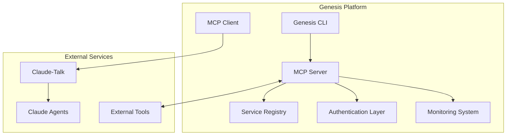

# MCP Protocol Support for Claude-Talk Integration

## Overview

This document provides a comprehensive guide to the Model Context Protocol (MCP) implementation in Genesis, designed for seamless integration with claude-talk and multi-agent coordination.

## Architecture

### Core Components



### Key Features

- **Protocol Support**: Full MCP 1.0 protocol implementation
- **Dual Transport**: WebSocket and HTTP support
- **Service Discovery**: Automated service registration and discovery
- **Authentication**: JWT and API key authentication strategies
- **Monitoring**: Comprehensive metrics and health monitoring
- **Resilience**: Circuit breakers, retry policies, and connection pooling
- **Testing**: Complete testing framework with performance benchmarks

## Quick Start

### 1. Installation

```bash
# Install TypeScript dependencies
cd lib/javascript/@whitehorse/core
npm install

# Build the MCP components
npm run build
```

### 2. Initialize MCP Configuration

```bash
# Initialize MCP configuration
g mcp init

# Start MCP server
g mcp start --port 8080

# Check server status
g mcp status
```

### 3. Register a Service

```bash
# Register a new MCP service
g mcp register \
  --service-id "example-agent" \
  --name "Example Agent Service" \
  --type "agent" \
  --endpoint "http://localhost:9000" \
  --capabilities "code-generation,testing"
```

### 4. Launch an Agent

```bash
# Launch a Claude agent via MCP
g mcp launch \
  --agent-type "backend-developer-agent" \
  --prompt "Implement a REST API for user management" \
  --context '{"language": "python", "framework": "fastapi"}'
```

## API Reference

### MCP Server

```typescript
import { MCPServer, MCPServerOptions } from '@whitehorse/core';

const server = new MCPServer({
  port: 8080,
  enableAuth: true,
  enableWebSocket: true,
  enableHttp: true,
  corsOrigins: ['*'],
  monitoring: {
    enabled: true,
    metricsPort: 8081
  }
});

await server.start();
```

### MCP Client

```typescript
import { MCPClient, MCPClientOptions } from '@whitehorse/core';

const client = new MCPClient({
  endpoint: 'http://localhost:8080',
  protocol: 'http',
  authentication: {
    type: 'bearer',
    token: 'your-jwt-token'
  }
});

await client.connect();

// Send a request
const response = await client.sendRequest('agent.launch', {
  agentType: 'backend-developer-agent',
  prompt: 'Create a new API endpoint'
});
```

### Service Registry

```typescript
import { ServiceRegistry } from '@whitehorse/core';

const registry = new ServiceRegistry();

// Register a service
await registry.registerService('my-service', {
  name: 'My Service',
  version: '1.0.0',
  type: 'agent',
  endpoint: 'http://localhost:9000',
  capabilities: ['code-generation'],
  healthCheckUrl: 'http://localhost:9000/health'
});

// Discover services
const services = registry.getServices({ type: 'agent' });
```

## Protocol Messages

### Request Message

```json
{
  "id": "uuid-v4",
  "timestamp": "2024-01-01T00:00:00Z",
  "version": "1.0.0",
  "source": "client-identifier",
  "target": "service-identifier",
  "type": "request",
  "method": "agent.launch",
  "params": {
    "agentType": "backend-developer-agent",
    "prompt": "Implement user authentication",
    "context": {
      "project": "my-project",
      "language": "python"
    },
    "timeout": 300000
  }
}
```

### Response Message

```json
{
  "id": "uuid-v4",
  "timestamp": "2024-01-01T00:00:00Z",
  "version": "1.0.0",
  "source": "server-identifier",
  "type": "response",
  "requestId": "original-request-uuid",
  "success": true,
  "result": {
    "sessionId": "agent-session-uuid",
    "status": "launched",
    "agentType": "backend-developer-agent"
  }
}
```

### Notification Message

```json
{
  "id": "uuid-v4",
  "timestamp": "2024-01-01T00:00:00Z",
  "version": "1.0.0",
  "source": "server-identifier",
  "type": "notification",
  "event": "agent.status_changed",
  "data": {
    "sessionId": "agent-session-uuid",
    "oldStatus": "running",
    "newStatus": "completed",
    "result": {
      "success": true,
      "artifacts": ["api.py", "test_api.py"]
    }
  }
}
```

## Authentication

### JWT Authentication

```typescript
import { JWTAuthStrategy } from '@whitehorse/core';

const jwtAuth = new JWTAuthStrategy({
  secret: process.env.JWT_SECRET,
  issuer: 'genesis-mcp',
  audience: 'mcp-services',
  expiresIn: '1h'
});

// Generate a token
const token = jwtAuth.generateToken(
  'user-123',
  ['agent-operator', 'service-manager'],
  ['agent.launch', 'service.register']
);
```

### API Key Authentication

```typescript
import { APIKeyAuthStrategy } from '@whitehorse/core';

const apiKeyAuth = new APIKeyAuthStrategy({
  keys: new Map(),
  hashAlgorithm: 'sha256'
});

// Generate and add an API key
const apiKey = apiKeyAuth.generateKey();
apiKeyAuth.addKey(
  apiKey,
  'service-123',
  ['service-manager'],
  ['service.register', 'service.unregister']
);
```

## Monitoring and Metrics

### Metrics Collection

The MCP server automatically collects metrics:

- **Protocol Metrics**: Message counts, latency, error rates
- **Service Metrics**: Registration, health status, response times
- **System Metrics**: Memory usage, CPU usage, connection counts

### Metrics Endpoints

- `GET /metrics` - Prometheus format metrics
- `GET /api/metrics` - JSON format metrics
- `GET /api/services/health` - Service health status
- `GET /health` - Server health check

### Example Metrics

```
# HELP mcp_messages_total Total number of MCP messages processed
# TYPE mcp_messages_total counter
mcp_messages_total{type="request"} 1234
mcp_messages_total{type="response"} 1230
mcp_messages_total{type="notification"} 45

# HELP mcp_request_duration_ms Request processing duration in milliseconds
# TYPE mcp_request_duration_ms histogram
mcp_request_duration_p50 125.5
mcp_request_duration_p95 450.2
mcp_request_duration_p99 890.1

# HELP mcp_active_connections Currently active connections
# TYPE mcp_active_connections gauge
mcp_active_connections 12
```

## Error Handling

### Error Types

```typescript
import {
  MCPError,
  ProtocolError,
  AuthenticationError,
  ServiceUnavailableError,
  TimeoutError
} from '@whitehorse/core';

// Custom error handling
try {
  await client.sendRequest('agent.launch', params);
} catch (error) {
  if (error instanceof TimeoutError) {
    // Handle timeout
  } else if (error instanceof AuthenticationError) {
    // Handle authentication failure
  } else if (error instanceof MCPError) {
    // Handle general MCP error
    console.log(`Error code: ${error.code}`);
    console.log(`Recoverable: ${error.recoverable}`);
  }
}
```

### Circuit Breaker

```typescript
import { CircuitBreaker } from '@whitehorse/core';

const circuitBreaker = new CircuitBreaker({
  failureThreshold: 5,
  resetTimeout: 60000,
  halfOpenMaxCalls: 3
});

const result = await circuitBreaker.execute(async () => {
  return await client.sendRequest('service.call', params);
});
```

### Retry Policy

```typescript
import { RetryPolicy } from '@whitehorse/core';

const retryPolicy = new RetryPolicy({
  maxAttempts: 3,
  initialDelay: 1000,
  maxDelay: 10000,
  backoffMultiplier: 2
});

const result = await retryPolicy.execute(async () => {
  return await client.sendRequest('agent.launch', params);
});
```

## Testing

### Unit Testing

```typescript
import { ProtocolTester, MCPTestRunner } from '@whitehorse/core';

// Protocol validation
const request = ProtocolTester.createTestRequest('test.echo', { message: 'hello' });
const validation = ProtocolTester.validateMessageStructure(request);
assert(validation.valid);

// Test runner
const runner = new MCPTestRunner();
const results = await runner.runSuite(MCPProtocolTestSuite);
```

### Integration Testing

```typescript
import { IntegrationTester, MockMCPServer, MockMCPClient } from '@whitehorse/core';

const tester = new IntegrationTester();
await tester.setup();

const result = await tester.testRequestResponse('test.echo', { message: 'test' });
assert(result.response.success);

await tester.teardown();
```

### Load Testing

```typescript
import { LoadTester } from '@whitehorse/core';

const loadTester = new LoadTester();
const results = await loadTester.runLoadTest({
  serverUrl: 'http://localhost:8080',
  concurrent: 10,
  requestsPerClient: 100,
  method: 'test.echo'
});

console.log(`Requests/sec: ${results.requestsPerSecond}`);
console.log(`Average latency: ${results.averageResponseTime}ms`);
```

## Claude-Talk Integration

### Setup

```python
from intelligence.solve.tools.claude_talk import ClaudeTalkClient

client = ClaudeTalkClient()

# Launch an agent through MCP
session_id = await client.launch_agent(
    prompt="Implement a REST API for user management",
    agent_type="backend-developer-agent",
    context={
        "mcp_enabled": True,
        "server_url": "http://localhost:8080"
    }
)
```

### Agent Coordination

```python
# Launch multiple agents in parallel
agent_specs = [
    {
        "prompt": "Implement backend API",
        "agent_type": "backend-developer-agent",
        "context": {"service": "user-api"}
    },
    {
        "prompt": "Create React frontend",
        "agent_type": "frontend-developer-agent",
        "context": {"service": "user-ui"}
    },
    {
        "prompt": "Setup infrastructure",
        "agent_type": "platform-engineer-agent",
        "context": {"service": "deployment"}
    }
]

session_ids = await launch_parallel_agents(agent_specs, client)

# Wait for completion
results = await wait_for_all_completions(session_ids, client)
```

## Configuration

### MCP Configuration File

```yaml
mcp:
  server:
    port: 8080
    host: "0.0.0.0"
    enableAuth: true
    enableWebSocket: true
    enableHttp: true
    corsOrigins: ["*"]
    maxConnections: 1000
    requestTimeout: 30000

  auth:
    enabled: true
    strategies: ["jwt", "api-key"]
    jwt:
      secret: "${MCP_JWT_SECRET}"
      issuer: "genesis-mcp"
      audience: "mcp-services"
      expiresIn: "1h"

  monitoring:
    enabled: true
    metricsPort: 8081
    healthCheckInterval: 30

  services:
    registry:
      maxServices: 100
      healthCheckInterval: 30

claude_talk:
  integration:
    enabled: true
    mock_mode: false
    session_timeout: 1800
```

### Environment Variables

```bash
# Required
export MCP_JWT_SECRET="your-jwt-secret-key"

# Optional
export MCP_SERVER_URL="http://localhost:8080"
export MCP_ENABLE_AUTH="true"
export MCP_LOG_LEVEL="info"
```

## Deployment

### Docker Deployment

```dockerfile
# Dockerfile.mcp-server
FROM node:18-alpine

WORKDIR /app

COPY lib/javascript/@whitehorse/core/package*.json ./
RUN npm ci --only=production

COPY lib/javascript/@whitehorse/core/dist ./dist
COPY config/mcp.yaml ./config/

EXPOSE 8080 8081

CMD ["node", "dist/mcp/server-standalone.js"]
```

### Kubernetes Deployment

```yaml
apiVersion: apps/v1
kind: Deployment
metadata:
  name: mcp-server
spec:
  replicas: 3
  selector:
    matchLabels:
      app: mcp-server
  template:
    metadata:
      labels:
        app: mcp-server
    spec:
      containers:
      - name: mcp-server
        image: genesis/mcp-server:latest
        ports:
        - containerPort: 8080
        - containerPort: 8081
        env:
        - name: MCP_JWT_SECRET
          valueFrom:
            secretKeyRef:
              name: mcp-secrets
              key: jwt-secret
        livenessProbe:
          httpGet:
            path: /health
            port: 8080
          initialDelaySeconds: 30
          periodSeconds: 10
        readinessProbe:
          httpGet:
            path: /health
            port: 8080
          initialDelaySeconds: 5
          periodSeconds: 5

---
apiVersion: v1
kind: Service
metadata:
  name: mcp-server-service
spec:
  selector:
    app: mcp-server
  ports:
  - name: api
    port: 8080
    targetPort: 8080
  - name: metrics
    port: 8081
    targetPort: 8081
  type: ClusterIP
```

### Terraform Deployment

```hcl
resource "google_cloud_run_service" "mcp_server" {
  name     = "mcp-server"
  location = var.region

  template {
    spec {
      containers {
        image = "gcr.io/${var.project_id}/mcp-server:latest"

        ports {
          container_port = 8080
        }

        env {
          name  = "MCP_JWT_SECRET"
          value_from {
            secret_key_ref {
              name = google_secret_manager_secret.mcp_jwt_secret.secret_id
              key  = "latest"
            }
          }
        }

        resources {
          limits = {
            cpu    = "1"
            memory = "512Mi"
          }
        }
      }
    }

    metadata {
      annotations = {
        "autoscaling.knative.dev/maxScale" = "10"
        "run.googleapis.com/cpu-throttling" = "false"
      }
    }
  }

  traffic {
    percent         = 100
    latest_revision = true
  }
}

resource "google_secret_manager_secret" "mcp_jwt_secret" {
  secret_id = "mcp-jwt-secret"

  replication {
    automatic = true
  }
}
```

## Performance Optimization

### Connection Pooling

```typescript
import { ConnectionPool } from '@whitehorse/core';

const pool = new ConnectionPool<MCPClient>(
  {
    maxConnections: 10,
    minConnections: 2,
    acquireTimeout: 10000,
    idleTimeout: 30000
  },
  async () => {
    const client = new MCPClient(clientConfig);
    await client.connect();
    return client;
  },
  async (client) => client.isConnected(),
  async (client) => client.disconnect()
);

// Use pooled connection
const client = await pool.acquire();
try {
  const response = await client.sendRequest('agent.launch', params);
} finally {
  await pool.release(client);
}
```

### Load Balancing

```typescript
import { LoadBalancer } from '@whitehorse/core';

const loadBalancer = new LoadBalancer({
  strategy: 'least-connections',
  healthCheckEnabled: true
}, async (endpoint) => {
  // Health check function
  const response = await fetch(`${endpoint}/health`);
  return response.ok;
});

// Add target endpoints
loadBalancer.addTarget('http://mcp-server-1:8080');
loadBalancer.addTarget('http://mcp-server-2:8080');
loadBalancer.addTarget('http://mcp-server-3:8080');

// Select best endpoint
const endpoint = loadBalancer.selectTarget();
```

## Troubleshooting

### Common Issues

#### Connection Refused

```bash
# Check if server is running
g mcp status

# Check port availability
netstat -tulpn | grep 8080

# Check logs
docker logs mcp-server
```

#### Authentication Failures

```bash
# Verify JWT secret
echo $MCP_JWT_SECRET

# Test with valid token
curl -H "Authorization: Bearer $JWT_TOKEN" \
     http://localhost:8080/api/mcp
```

#### High Latency

```bash
# Check metrics
curl http://localhost:8081/metrics | grep latency

# Monitor connections
curl http://localhost:8080/api/metrics | jq '.activeConnections'
```

### Debug Mode

```bash
# Enable debug logging
export MCP_LOG_LEVEL=debug
g mcp start

# Enable protocol tracing
export MCP_TRACE_PROTOCOL=true
```

## Contributing

### Development Setup

```bash
# Clone repository
git clone https://github.com/your-org/genesis.git
cd genesis

# Install dependencies
cd lib/javascript/@whitehorse/core
npm install

# Run tests
npm test

# Build
npm run build
```

### Testing

```bash
# Run unit tests
npm test

# Run integration tests
python -m pytest tests/integration/test_mcp_claude_talk_integration.py

# Run performance benchmarks
python tests/integration/test_mcp_claude_talk_integration.py
```

## Roadmap

### Planned Features

- **Advanced Routing**: Intelligent message routing based on content
- **Multi-tenancy**: Support for multiple isolated tenants
- **Federation**: Connect multiple MCP servers
- **GraphQL Support**: GraphQL over MCP protocol
- **Streaming**: Support for streaming responses
- **Caching**: Intelligent response caching

### Version History

- **v1.0.0**: Initial MCP implementation with claude-talk integration
- **v0.9.0**: Beta release with core protocol support
- **v0.8.0**: Alpha release with basic functionality

For the latest updates and detailed changelog, see [CHANGELOG.md](../CHANGELOG.md).

## Support

- **Documentation**: [Genesis Documentation](../README.md)
- **Issues**: [GitHub Issues](https://github.com/your-org/genesis/issues)
- **Discussions**: [GitHub Discussions](https://github.com/your-org/genesis/discussions)
- **Support**: support@genesis-platform.dev
