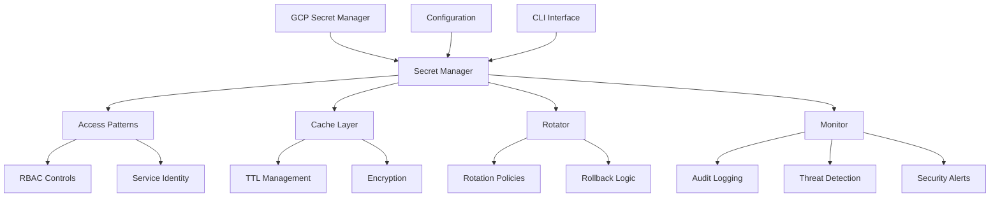

# Genesis Secret Management Security Guide

**SHIELD Methodology Implementation for Comprehensive Secret Management**

This guide provides comprehensive documentation for the Genesis Secret Management system, implementing the SHIELD (Scan, Harden, Isolate, Encrypt, Log, Defend) methodology for secure secret management across both **claude-talk** and **agent-cage** migrations.

## Table of Contents

1. [Overview](#overview)
2. [SHIELD Methodology](#shield-methodology)
3. [Architecture](#architecture)
4. [Security Implementation](#security-implementation)
5. [Usage Examples](#usage-examples)
6. [Best Practices](#best-practices)
7. [Troubleshooting](#troubleshooting)
8. [Compliance and Audit](#compliance-and-audit)

## Overview

The Genesis Secret Management system provides enterprise-grade secret management capabilities with comprehensive security controls, automated rotation, real-time monitoring, and threat detection. It supports both Python and TypeScript/Node.js applications and integrates seamlessly with Google Cloud Secret Manager.

### Key Features

- **🔍 SCAN**: Comprehensive secret discovery and vulnerability scanning
- **🔒 HARDEN**: Secure access patterns with RBAC and authentication
- **🏠 ISOLATE**: Multi-environment and service-based isolation
- **🔐 ENCRYPT**: End-to-end encryption with automated rotation
- **📊 LOG**: Complete audit logging and compliance tracking
- **🛡️ DEFEND**: Real-time threat detection and security monitoring

### Supported Use Cases

- **Claude-Talk Migration**: API keys, OAuth tokens, database credentials, session secrets
- **Agent-Cage Migration**: VM access keys, container registry tokens, cloud provider credentials
- **Multi-Service Architecture**: Service-to-service authentication, external integrations
- **Compliance Requirements**: SOC2, PCI-DSS, GDPR audit trails and controls

## SHIELD Methodology

### S - SCAN: Secret Discovery and Validation

The SCAN phase focuses on comprehensive discovery and validation of secrets across your infrastructure.

#### Python Implementation

```python
from core.secrets import get_secret_manager

# Initialize secret manager
secret_manager = get_secret_manager(
    project_id="your-project-id",
    environment="production"
)

# Discover all secrets with filtering
secrets = secret_manager.scan_secrets(filters={
    "environment": "production",
    "service": "claude-talk"
})

# Validate secret health
health_report = secret_manager.validate_secret_health()
print(f"Found {health_report['secrets_discovered']} secrets")
print(f"Security issues: {len(health_report['security_issues'])}")
```

#### TypeScript Implementation

```typescript
import { createSecretManager } from '@whitehorse/core/secrets';

// Initialize secret manager
const secretManager = createSecretManager({
  projectId: 'your-project-id',
  environment: 'production'
});

// Discover secrets
const secrets = await secretManager.scanSecrets({
  environment: 'production',
  service: 'claude-talk'
});

// Validate health
const healthReport = await secretManager.validateSecretHealth();
console.log(`Found ${healthReport.secretsDiscovered} secrets`);
```

#### CLI Usage

```bash
# Scan all secrets
g secret scan --format table

# Scan with filters
g secret scan --environment production --service claude-talk

# Health check
g secret health
```

### H - HARDEN: Secure Access Patterns

The HARDEN phase implements secure access patterns with comprehensive authentication and authorization.

#### Access Control Configuration

```python
from core.secrets.access_patterns import AccessLevel

# Register access control for sensitive secrets
secret_manager.access_pattern.register_access_control(
    secret_pattern="claude-talk-*",
    access_level=AccessLevel.RESTRICTED,
    allowed_services=["claude-talk-api", "claude-talk-worker"],
    allowed_environments=["production", "staging"]
)

# Secure secret retrieval with context
secret_value = secret_manager.access_pattern.secure_get_secret(
    secret_name="claude-talk-api-key",
    requesting_service="claude-talk-api",
    environment="production"
)
```

#### TypeScript Access Patterns

```typescript
import { AccessLevel } from '@whitehorse/core/secrets';

// Register access controls
secretManager.accessPatternInstance.registerAccessControl(
  'claude-talk-*',
  {
    accessLevel: AccessLevel.RESTRICTED,
    allowedServices: ['claude-talk-api', 'claude-talk-worker'],
    allowedEnvironments: ['production', 'staging']
  }
);

// Secure retrieval
const secretValue = await secretManager.getSecret('claude-talk-api-key', {
  context: {
    requestingService: 'claude-talk-api',
    environment: 'production'
  }
});
```

### I - ISOLATE: Multi-Environment Isolation

The ISOLATE phase ensures proper separation between environments and services.

#### Environment Configuration

```yaml
# config/secrets.yaml
environments:
  development:
    secret_management:
      cache:
        default_ttl_seconds: 180
      rotation:
        auto_rotate: false
      monitoring:
        threat_detection: false

  production:
    secret_management:
      cache:
        default_ttl_seconds: 600
      rotation:
        auto_rotate: true
        notification_days_before: 14
      access_control:
        require_service_identity: true
```

#### Service-Specific Isolation

```python
# Create secrets with isolation labels
secret_manager.create_secret(
    secret_name="claude-talk-db-password",
    secret_value=generated_password,
    labels={
        "environment": "production",
        "service": "claude-talk",
        "tier": "database",
        "criticality": "high"
    }
)
```

### E - ENCRYPT: Automated Secret Rotation

The ENCRYPT phase provides automated secret rotation with rollback capabilities.

#### Rotation Policies

```python
from core.secrets.rotation import RotationPolicy, RotationType

# Register rotation policy
secret_manager.rotator.register_rotation_policy(
    secret_pattern="*-api-key-*",
    rotation_interval_days=30,
    auto_rotate=True,
    rollback_on_failure=True,
    notification_days_before=7
)

# Manual rotation
new_version = secret_manager.rotate_secret(
    secret_name="claude-talk-api-key",
    rotation_type=RotationType.MANUAL
)

# Emergency rotation
emergency_version = secret_manager.rotator.emergency_rotate_secret(
    secret_name="compromised-secret",
    reason="Potential security breach detected"
)
```

#### Automated Rotation

```bash
# Check rotation status
g secret rotation-status

# Perform auto-rotation
g secret rotation-status --auto-rotate
```

### L - LOG: Comprehensive Audit Logging

The LOG phase provides complete audit trails for all secret operations.

#### Audit Log Retrieval

```python
from datetime import datetime, timedelta

# Get audit logs
audit_logs = secret_manager.get_secret_audit_log(
    secret_name="claude-talk-api-key",
    start_time=datetime.now() - timedelta(days=7),
    operation="get"
)

for entry in audit_logs:
    print(f"{entry['timestamp']}: {entry['operation']} by {entry['user_identity']}")
```

#### Security Metrics

```python
# Get security metrics
metrics = secret_manager.monitor.get_security_metrics()

print(f"Total operations: {metrics['total_operations']}")
print(f"Failed attempts: {metrics['operations_by_status'].get('failure', 0)}")
print(f"High-risk operations: {metrics['risk_distribution']['high']}")
```

### D - DEFEND: Real-time Threat Detection

The DEFEND phase implements real-time monitoring and threat detection.

#### Security Alerts

```python
# Get security alerts
alerts = secret_manager.monitor.get_security_alerts(
    alert_level=AlertLevel.CRITICAL,
    resolved=False
)

for alert in alerts:
    print(f"CRITICAL: {alert['description']}")
    print(f"Recommended actions: {alert['recommended_actions']}")
```

#### Custom Alert Handlers

```python
def security_alert_handler(alert):
    """Custom alert handler for security events"""
    if alert.alert_level == AlertLevel.CRITICAL:
        # Send immediate notification
        send_pager_duty_alert(alert)
    elif alert.alert_level == AlertLevel.ERROR:
        # Send email notification
        send_email_alert(alert)

# Register alert handler
secret_manager = get_secret_manager(
    project_id="your-project-id",
    alert_callback=security_alert_handler
)
```

## Architecture

### Core Components



### Integration Points

#### Claude-Talk Integration

```typescript
// claude-talk/src/config/secrets.ts
import { createSecretManager } from '@whitehorse/core/secrets';

export const secretManager = createSecretManager({
  projectId: process.env.PROJECT_ID!,
  environment: process.env.ENVIRONMENT as any,
  enableCaching: true,
  enableRotation: true,
  enableMonitoring: true
});

// Get Claude API key
export async function getClaudeApiKey(): Promise<string> {
  return secretManager.getSecret('claude-talk-claude-api-key', {
    context: {
      requestingService: 'claude-talk-api',
      serviceIdentity: process.env.SERVICE_ACCOUNT_EMAIL
    }
  });
}
```

#### Agent-Cage Integration

```python
# agent-cage/src/secrets.py
from core.secrets import get_secret_manager
from core.secrets.access_patterns import AccessLevel

secret_manager = get_secret_manager()

# Register high-security access controls for agent infrastructure
secret_manager.access_pattern.register_access_control(
    secret_pattern="agent-cage-vm-*",
    access_level=AccessLevel.TOP_SECRET,
    allowed_services=["agent-cage-controller"],
    require_mfa=True
)

async def get_vm_access_key(agent_id: str) -> str:
    """Get VM access key for specific agent"""
    return secret_manager.get_secret(
        secret_name=f"agent-cage-vm-access-{agent_id}",
        context={
            "requesting_service": "agent-cage-controller",
            "agent_id": agent_id
        }
    )
```

## Security Implementation

### Authentication and Authorization

#### Service Account Configuration

```bash
# Create service account for secret access
gcloud iam service-accounts create genesis-secret-manager \
    --display-name="Genesis Secret Manager" \
    --description="Service account for Genesis secret management"

# Grant necessary permissions
gcloud projects add-iam-policy-binding $PROJECT_ID \
    --member="serviceAccount:genesis-secret-manager@$PROJECT_ID.iam.gserviceaccount.com" \
    --role="roles/secretmanager.admin"
```

#### Workload Identity Setup

```bash
# Configure workload identity for Kubernetes
gcloud iam service-accounts add-iam-policy-binding \
    genesis-secret-manager@$PROJECT_ID.iam.gserviceaccount.com \
    --role roles/iam.workloadIdentityUser \
    --member "serviceAccount:$PROJECT_ID.svc.id.goog[default/genesis-secret-manager]"
```

### Network Security

#### VPC Configuration

```terraform
# Secure VPC for secret management
resource "google_compute_network" "genesis_secrets_vpc" {
  name                    = "genesis-secrets-vpc"
  auto_create_subnetworks = false
}

resource "google_compute_firewall" "deny_all_ingress" {
  name    = "genesis-deny-all-ingress"
  network = google_compute_network.genesis_secrets_vpc.name

  deny {
    protocol = "all"
  }

  direction = "INGRESS"
  priority  = 1000
  source_ranges = ["0.0.0.0/0"]
}

resource "google_compute_firewall" "allow_secret_manager" {
  name    = "genesis-allow-secret-manager"
  network = google_compute_network.genesis_secrets_vpc.name

  allow {
    protocol = "tcp"
    ports    = ["443"]
  }

  direction = "EGRESS"
  target_tags = ["genesis-secret-client"]
  destination_ranges = ["199.36.153.8/30"] # Google APIs
}
```

### Encryption Configuration

#### Encryption at Rest

```yaml
# Customer-managed encryption keys
apiVersion: v1
kind: Secret
metadata:
  name: genesis-secret-encryption-key
type: Opaque
data:
  encryption-key: <base64-encoded-key>

# Apply to secret manager configuration
secret_management:
  security:
    encryption_at_rest: true
    customer_managed_key: "projects/PROJECT_ID/locations/LOCATION/keyRings/RING_ID/cryptoKeys/KEY_ID"
```

## Usage Examples

### Basic Secret Operations

#### Creating Secrets

```bash
# Create a database password
g secret create claude-talk-db-password \
    --label environment=production \
    --label service=claude-talk \
    --label tier=database

# Create an API key with custom rotation
g secret create claude-talk-api-key \
    --label environment=production \
    --service claude-talk
```

#### Retrieving Secrets

```python
# Python - Basic retrieval
password = secret_manager.get_secret("claude-talk-db-password")

# Python - With caching disabled
api_key = secret_manager.get_secret(
    secret_name="claude-talk-api-key",
    use_cache=False,
    validate=True
)

# Python - Batch retrieval
secrets = secret_manager.batch_get_secrets([
    "claude-talk-db-password",
    "claude-talk-api-key",
    "claude-talk-session-secret"
])
```

```typescript
// TypeScript - Basic retrieval
const password = await secretManager.getSecret('claude-talk-db-password');

// TypeScript - With context
const apiKey = await secretManager.getSecret('claude-talk-api-key', {
  context: {
    requestingService: 'claude-talk-api',
    environment: 'production'
  }
});

// TypeScript - Batch retrieval
const secrets = await secretManager.batchGetSecrets([
  'claude-talk-db-password',
  'claude-talk-api-key'
]);
```

### Advanced Security Patterns

#### Circuit Breaker Pattern

```python
from core.retry.circuit_breaker import CircuitBreaker

# Wrap secret retrieval with circuit breaker
@CircuitBreaker(failure_threshold=5, reset_timeout=60)
def get_secret_with_circuit_breaker(secret_name: str) -> str:
    return secret_manager.get_secret(secret_name)

# Usage
try:
    api_key = get_secret_with_circuit_breaker("claude-talk-api-key")
except CircuitBreakerError:
    # Fallback to cached value or default
    api_key = get_cached_api_key()
```

#### Secret Versioning

```python
# Get specific version
old_key = secret_manager.get_secret("claude-talk-api-key", version="2")

# Compare versions
current_key = secret_manager.get_secret("claude-talk-api-key", version="latest")
if old_key != current_key:
    print("Secret has been rotated")
```

### Monitoring and Alerting

#### Custom Metrics

```python
from core.secrets.monitoring import ThreatType, AlertLevel

# Custom threat detection
def detect_unusual_access_pattern(secret_name: str, access_count: int):
    if access_count > 100:  # Threshold exceeded
        secret_manager.monitor._create_security_alert(
            threat_type=ThreatType.EXCESSIVE_ACCESS,
            alert_level=AlertLevel.WARNING,
            secret_name=secret_name,
            description=f"Unusual access pattern: {access_count} accesses in 1 hour",
            evidence={"access_count": access_count}
        )
```

#### Integration with Monitoring Systems

```python
# Prometheus metrics export
from prometheus_client import Counter, Histogram

secret_access_counter = Counter(
    'genesis_secret_access_total',
    'Total secret access attempts',
    ['secret_name', 'status', 'service']
)

secret_access_duration = Histogram(
    'genesis_secret_access_duration_seconds',
    'Secret access duration'
)

# Custom monitoring integration
def monitor_secret_access(secret_name: str, status: str, service: str, duration: float):
    secret_access_counter.labels(
        secret_name=secret_name,
        status=status,
        service=service
    ).inc()

    secret_access_duration.observe(duration)
```

## Best Practices

### Development Guidelines

#### 1. Secret Naming Conventions

```bash
# Follow consistent naming patterns
{service}-{environment}-{type}-{purpose}

# Examples:
claude-talk-prod-api-key-openai
agent-cage-stage-db-password-primary
genesis-prod-oauth-secret-github
```

#### 2. Environment Separation

```python
# Use environment-specific configurations
def get_secret_manager_for_env(environment: str):
    return get_secret_manager(
        project_id=f"genesis-{environment}",
        environment=environment
    )

# Development
dev_manager = get_secret_manager_for_env("development")

# Production
prod_manager = get_secret_manager_for_env("production")
```

#### 3. Error Handling

```python
from core.secrets import (
    SecretNotFoundError,
    SecretAccessDeniedError,
    SecretRotationError
)

def safe_get_secret(secret_name: str, fallback: str = None) -> str:
    try:
        return secret_manager.get_secret(secret_name)
    except SecretNotFoundError:
        if fallback:
            logger.warning(f"Secret {secret_name} not found, using fallback")
            return fallback
        raise
    except SecretAccessDeniedError:
        logger.error(f"Access denied to secret {secret_name}")
        raise
    except Exception as e:
        logger.error(f"Unexpected error retrieving secret {secret_name}: {e}")
        raise
```

### Security Best Practices

#### 1. Principle of Least Privilege

```python
# Register restrictive access controls
secret_manager.access_pattern.register_access_control(
    secret_pattern="*-prod-*",
    access_level=AccessLevel.CONFIDENTIAL,
    allowed_services=["authorized-service"],
    allowed_environments=["production"]
)
```

#### 2. Regular Rotation

```yaml
# Configure aggressive rotation for sensitive secrets
secret_policies:
  - pattern: "*-api-key-*"
    rotation_interval_days: 30
    auto_rotate: true

  - pattern: "*-oauth-*"
    rotation_interval_days: 45
    require_approval: true

  - pattern: "*-db-password-*"
    rotation_interval_days: 60
    notification_days_before: 14
```

#### 3. Monitoring and Alerting

```python
# Set up comprehensive monitoring
alert_rules = [
    {
        "name": "excessive_secret_access",
        "condition": "access_rate > 50 per minute",
        "alert_level": AlertLevel.WARNING,
        "channels": ["slack", "email"]
    },
    {
        "name": "failed_rotation",
        "condition": "rotation_status == failed",
        "alert_level": AlertLevel.CRITICAL,
        "channels": ["slack", "email", "pagerduty"]
    }
]
```

### Performance Optimization

#### 1. Caching Strategy

```python
# Configure cache based on secret sensitivity
high_security_secrets = ["*-prod-api-key-*", "*-oauth-secret-*"]
low_security_secrets = ["*-dev-*", "*-config-*"]

# Short TTL for high security
for pattern in high_security_secrets:
    secret_manager.cache.set_ttl_for_pattern(pattern, ttl_seconds=60)

# Longer TTL for low security
for pattern in low_security_secrets:
    secret_manager.cache.set_ttl_for_pattern(pattern, ttl_seconds=1800)
```

#### 2. Batch Operations

```python
# Retrieve multiple secrets efficiently
required_secrets = [
    "claude-talk-api-key",
    "claude-talk-db-password",
    "claude-talk-session-secret"
]

secrets = secret_manager.batch_get_secrets(
    required_secrets,
    fail_on_error=True
)

# Use retrieved secrets
api_key = secrets["claude-talk-api-key"]
db_password = secrets["claude-talk-db-password"]
```

## Troubleshooting

### Common Issues

#### 1. Permission Denied Errors

**Error**: `SecretAccessDeniedError: Access denied to secret 'claude-talk-api-key'`

**Solution**:
```bash
# Check IAM permissions
gcloud projects get-iam-policy $PROJECT_ID

# Grant necessary role
gcloud projects add-iam-policy-binding $PROJECT_ID \
    --member="serviceAccount:your-service@$PROJECT_ID.iam.gserviceaccount.com" \
    --role="roles/secretmanager.secretAccessor"
```

#### 2. Secret Not Found

**Error**: `SecretNotFoundError: Secret 'nonexistent-secret' not found`

**Solution**:
```bash
# List all secrets
g secret scan

# Create the missing secret
g secret create nonexistent-secret --value "your-secret-value"
```

#### 3. Rotation Failures

**Error**: `SecretRotationError: Failed to rotate secret 'api-key': validation failed`

**Solution**:
```python
# Debug rotation issues
rotation_history = secret_manager.rotator.get_rotation_history("api-key")
for record in rotation_history:
    if record["status"] == "failed":
        print(f"Rotation {record['rotation_id']} failed: {record['error_message']}")

# Manual rotation with custom value
try:
    secret_manager.rotate_secret(
        secret_name="api-key",
        new_value="manually-generated-value",
        validate=False  # Skip validation if needed
    )
except SecretRotationError as e:
    print(f"Manual rotation failed: {e}")
```

### Debugging Tools

#### 1. Secret Health Check

```bash
# Comprehensive health check
g secret health --format json > health_report.json

# Check specific secret
g secret get test-secret --format json
```

#### 2. Audit Log Analysis

```python
# Analyze failed access attempts
failed_attempts = secret_manager.get_secret_audit_log(
    status="failure",
    start_time=datetime.now() - timedelta(hours=24)
)

for attempt in failed_attempts:
    print(f"Failed access: {attempt['secret_name']} by {attempt['user_identity']} at {attempt['timestamp']}")
```

#### 3. Performance Monitoring

```bash
# Check cache performance
g secret metrics --start-time "2024-01-01T00:00:00Z"

# Monitor specific secret
g secret audit --secret-name claude-talk-api-key --limit 100
```

## Compliance and Audit

### SOC2 Compliance

The Genesis Secret Management system provides the following SOC2 controls:

#### CC6.1 - Logical and Physical Access Controls

- **Implementation**: Service account-based authentication, RBAC controls, network isolation
- **Evidence**: Audit logs showing all access attempts with service identity
- **Monitoring**: Real-time alerting on unauthorized access attempts

```python
# SOC2 audit report generation
def generate_soc2_access_report(start_date: datetime, end_date: datetime):
    audit_logs = secret_manager.get_secret_audit_log(
        start_time=start_date,
        end_time=end_date
    )

    return {
        "report_period": f"{start_date} to {end_date}",
        "total_access_attempts": len(audit_logs),
        "successful_access": len([log for log in audit_logs if log["status"] == "success"]),
        "failed_access": len([log for log in audit_logs if log["status"] == "failure"]),
        "unique_users": len(set(log["user_identity"] for log in audit_logs if log["user_identity"])),
        "compliance_violations": []  # Populated based on policy checks
    }
```

#### CC6.3 - Encryption

- **Implementation**: End-to-end encryption using GCP KMS, encrypted storage, encrypted transit
- **Evidence**: Configuration showing customer-managed encryption keys
- **Monitoring**: Alerts on encryption failures or downgrades

### PCI-DSS Compliance

For environments processing payment data:

#### Requirement 3 - Protect Stored Cardholder Data

```python
# PCI-DSS compliant secret handling
@pci_compliant_operation
def store_payment_secret(secret_name: str, secret_value: str):
    # Validate PCI compliance
    if not is_pci_environment():
        raise ComplianceError("PCI secrets must be stored in PCI-compliant environment")

    # Use strong encryption
    return secret_manager.create_secret(
        secret_name=secret_name,
        secret_value=secret_value,
        labels={
            "pci_scope": "true",
            "data_classification": "restricted",
            "compliance_framework": "pci-dss"
        },
        encryption_key="projects/PROJECT/locations/LOCATION/keyRings/pci-ring/cryptoKeys/pci-key"
    )
```

#### Requirement 8 - Identify and Authenticate Access

```python
# PCI-DSS access controls
secret_manager.access_pattern.register_access_control(
    secret_pattern="*-pci-*",
    access_level=AccessLevel.TOP_SECRET,
    allowed_services=["pci-compliant-service"],
    require_mfa=True,
    custom_validator=validate_pci_access
)

def validate_pci_access(secret_name: str, context: dict) -> bool:
    # Validate PCI compliance requirements
    return (
        context.get("pci_certified") == True and
        context.get("mfa_verified") == True and
        context.get("access_approved") == True
    )
```

### GDPR Compliance

For European data processing:

#### Data Processing Records

```python
def log_gdpr_data_access(secret_name: str, purpose: str, legal_basis: str):
    """Log GDPR-compliant data access"""
    secret_manager.monitor.log_secret_access(
        operation="gdpr_data_access",
        status="success",
        metadata={
            "gdpr_purpose": purpose,
            "legal_basis": legal_basis,
            "data_subject_rights": "informed",
            "retention_policy": "applied"
        },
        secret_name=secret_name
    )
```

### Audit Reports

#### Automated Compliance Reporting

```python
def generate_compliance_report(framework: str, period_days: int = 30) -> dict:
    """Generate compliance report for specified framework"""
    end_date = datetime.utcnow()
    start_date = end_date - timedelta(days=period_days)

    # Get audit data
    audit_logs = secret_manager.get_secret_audit_log(
        start_time=start_date,
        end_time=end_date
    )

    # Get security metrics
    metrics = secret_manager.monitor.get_security_metrics(start_date, end_date)

    # Get health report
    health = secret_manager.validate_secret_health()

    return {
        "compliance_framework": framework,
        "report_period": f"{start_date.isoformat()} to {end_date.isoformat()}",
        "executive_summary": {
            "total_secrets": health["secrets_discovered"],
            "security_issues": len(health["security_issues"]),
            "compliance_violations": count_compliance_violations(audit_logs, framework),
            "overall_compliance_score": calculate_compliance_score(metrics, health, framework)
        },
        "detailed_findings": generate_detailed_findings(audit_logs, metrics, health, framework),
        "recommendations": generate_compliance_recommendations(health, framework),
        "evidence_artifacts": {
            "audit_logs_count": len(audit_logs),
            "metrics_collected": bool(metrics),
            "health_check_passed": health["secrets_validated"] == health["secrets_discovered"]
        }
    }
```

---

## Quick Reference

### CLI Commands

```bash
# Secret Discovery
g secret scan                              # Discover all secrets
g secret scan --environment production     # Filter by environment
g secret health                           # Health check

# Secret Operations
g secret get secret-name                  # Get secret value
g secret create secret-name               # Create new secret
g secret rotate secret-name               # Rotate secret
g secret delete secret-name --force       # Delete secret

# Monitoring
g secret audit --secret-name api-key      # View audit logs
g secret metrics                          # View security metrics
g secret rotation-status --auto-rotate    # Check and perform rotation
```

### Python API

```python
from core.secrets import get_secret_manager

# Initialize
manager = get_secret_manager(project_id="project", environment="prod")

# Basic operations
value = manager.get_secret("secret-name")
manager.create_secret("new-secret", "secret-value")
manager.rotate_secret("secret-name")

# Advanced features
health = manager.validate_secret_health()
audit_logs = manager.get_secret_audit_log()
metrics = manager.monitor.get_security_metrics()
```

### TypeScript API

```typescript
import { createSecretManager } from '@whitehorse/core/secrets';

// Initialize
const manager = createSecretManager({
  projectId: 'project',
  environment: 'production'
});

// Basic operations
const value = await manager.getSecret('secret-name');
await manager.createSecret('new-secret', 'secret-value');
await manager.rotateSecret('secret-name');

// Advanced features
const health = await manager.validateSecretHealth();
const metrics = await manager.monitorInstance?.getSecurityMetrics();
```

---

**For additional support or questions, please refer to the [Genesis Documentation](../README.md) or contact the security team.**
